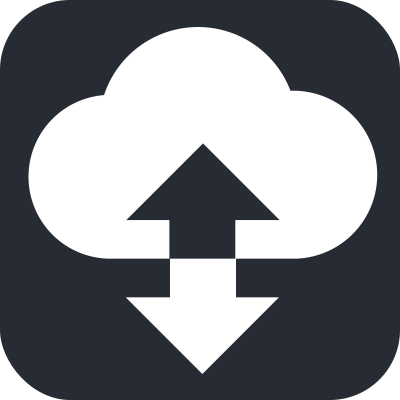
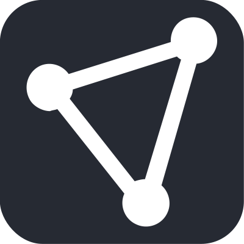

# Web clients

This project is a monorepo hosting the proton web clients. It includes the web applications, their dependencies & shared modules as well as all tooling surrounding development of the web clients (as well as some additional miscellaneous things).

-    <span style="vertical-align: middle; display: inline-block">Proton Mail</span>
-    <span style="vertical-align: middle; display: inline-block">Proton Calendar</span>
-    <span style="vertical-align: middle; display: inline-block">Proton Drive</span>
-    <span style="vertical-align: middle; display: inline-block">Proton Account</span>
-    <span style="vertical-align: middle; display: inline-block">Proton VPN Account</span>

Technically, this monorepo is based on Yarn 2 & Yarn Workspaces, with unified versioning for all packages inside.

## Getting Started

You'll need to have the following environment to work with this project

-   Node.js LTS
-   Yarn 2
-   git

```console
# Clone the project
git clone https://github.com/ProtonMail/web-clients.git
git clone git@github.com:ProtonMail/web-clients.git

# Install all dependencies for the entire monorepo & symlink
# local dependents to one another

yarn install

# Run web clients by running proton-<package-name>
# Example: proton mail web client
yarn workspace proton-mail start
```

For additional details on how to interact with the monorepo, see the [yarn docs](https://yarnpkg.com/) for reference.

## Help us to translate the project

You can help us to translate the application on crowdin.

- For proton-mail, proton-drive, proton-account: [crowdin ProtonMail](https://crowdin.com/project/protonmail)
- For proton-calendar: [crowdin ProtonCalendar](https://crowdin.com/project/proton-test-3)
- For proton-mail, proton-drive, proton-account: [crowdin ProtonVPN](https://crowdin.com/project/protonvpn)


## License

The code and data files in this distribution are licensed under the terms of the GNU General Public License as published by the Free Software Foundation, either version 3 of the License, or (at your option) any later version. See https://www.gnu.org/licenses/ for a copy of this license.

See [LICENSE](LICENSE) file
