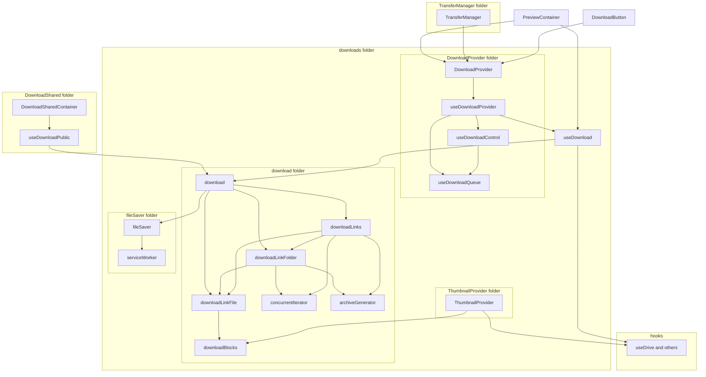

# Download Architecture

The download code itself is in the download subfolder. There is the code to download only one block, blocks of one file, recursively the whole folder, or the selection of files in the folder (at least that is limited by GUI, technically speaking, there is no limit to download files from different folders or even shares). But the caller should avoid direct access to those functions and use the main entry point `initDownload`, which accepts an array of links to be downloaded, and it chooses the proper path based on the provided list.

In the case of

-   one file, `downloadLinkFile.ts` is used, which is using `downloadBlocks.ts` and `downloadBlock.ts` helpers. The file is streamed right back in the stream returned from the `start` method provided from `initDownload`.
-   one folder, `downloadLinkFolder.ts` is used, which is loading the folder children and recursively calls `downloadLinkFile.ts` mentioned above. The file streams are added to the archive iterator, which provides a stream of zip archive back to the caller, also as a response from calling `start`.
-   multiple files or folders, `downloadLinks.ts` is used. That calls for all passed links `downloadLinkFile.ts` or uses helper from `downloadLinkFolder.ts` to get the whole folder structure and creates an archive similarly as `downloadLinkFolder.ts` does. The difference is, in this case, files are at the root of the archive, whereas in the previous case, all children are at the root of the archive (the folder itself is not part of the archive).

In all cases, the returned stream is passed down to `fileSaver.ts`. It is singleton handling service worker and passing the stream to that service worker, which streams the content to the browser. It works by creating a special local path with the provided stream and opening it by injecting an iframe to that local endpoint (living in the service worker only) to the main page. When this method fails, or the file is too small for such a complex solution, file saver fallbacks to buffering solution to buffer the whole file in memory and download in one go at the end. Note this is not possible for huge files, especially when device has not enough memory.

The download code is pure JavaScript, no React involved, and thus no API handlers. Everything needs to be passed as a callback, such as `getChildren`, `getBlocks`, or `getKeys` (and event handlers). To make it more convenient to call from other places, `useDownload.ts` hook exists to connect pure download code with our API.

This hook is then used by `DownloadProvider`. The provider is basically just the queue (containing also progresses and controls) of download transfers shown in the transfer manager. If the transfer should not be visible in the transfer manager, the download provider should not be used. For example, thumbnails are handled by `ThumbnailDownloadProvider.ts` (which uses directly `downloadBlock.ts`), or preview uses the `useDownload.ts` helper hook.

