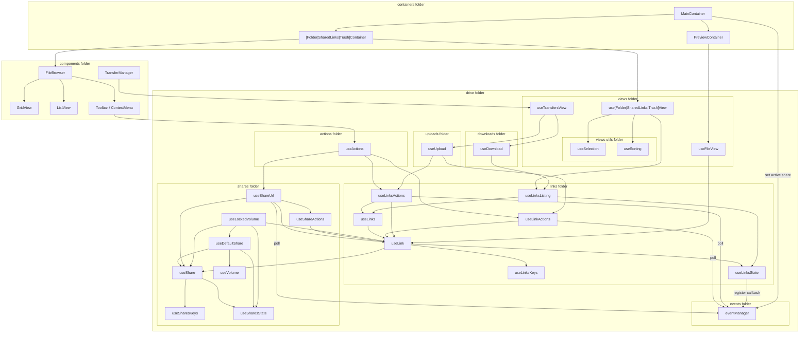

# Drive Architecture

The main Drive logic, where all the magic happens.

The app has several states which are automatically updated using an event loop and all possible actions available. The idea is to keep the implementation details hidden from the outside and export friendly interfaces to be used in simple enough React components. Therefore, prefer to use what is re-exported in the top module only, and add new exports wisely.

The central part is the link for sure. `useLink` provides methods to get decrypted links or their keys. If the link is not in the cache yet, it will fetch it from API, decrypt it and store it in the cache. Using links directly should not be needed and should be a sign of bad design. At least, it might not be an efficient way to get data. For that, there is `useLinksListing` which queries APIs per page and ensures the needed links to be presented to the user are ready. This hook has its own state and complex algorithm to properly get all links from API even if conditions in between changes. To do anything with links, such as rename link or move links elsewhere, there are two hooks that should be used: `useLinkActions` and `useLinksActions`. Basically, it could be one, but it would be a pretty long one, and this seems like a nice clear separation. `useLinksState` or `useLinksKeys` are a very internal implementation detail that should not be used outside of the links folder.

But the link cannot work without its share. Every user has some default share with all files, which points to the root link. Any link in that share can have its own share to be used for sharing with other members or for sharing using the share URL. That's the reason why the graph looks a bit like recursive dependencies. `useShare` provides the least possible implementation for shares which doesn't need any information about the link, that is fetching and decrypting shares with storing the state similarly like links do (`useSharesState` and `useSharesKeys`). Sharing options (`useShareActions` or `useShareUrl`) then can depend on both `useLink` and `useShare` and combine logic into sharing capability. Similarly, `useLockedVolume` can combine both to provide ways to restore locked files.

So far, this is still quite hard to use. You need to know a lot before doing any action, not to mention the need to handle all possible errors. Here comes `views` folder with its hooks providing way nicer interfaces for React components. We can see some parallels with database views. It is not storing any extra information; it is just a bit different view to make stuff easier. Here we have, for example, `useFolderView`, which can provide all necessary logic for `FileBrowser`, such as loading, sorting, or selection; or `useFileView`, which can handle preview with navigation; or `useTransfersView` to combine upload and download transfers with global actions for easier use in `TransferManager`.

The last important part is `useActions` from `actions` folder which wraps actions from `useLinkActions` and `useLinksActions` and `useShareUrl`, and adds error handling with creating notification to user.

Details about upload and download code are presented here as simple one box, but actually, it is very complex, and to learn more about it, read on in own architecture files in uploads and download folders.

