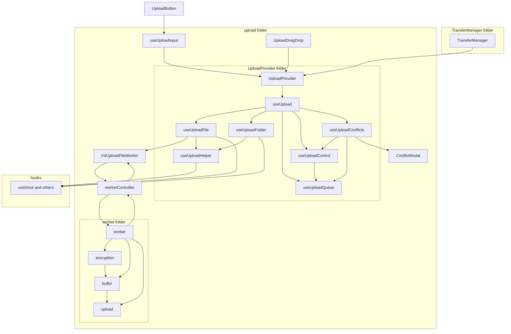

# Upload Architecture

```mermaid
graph TD
    UploadButton

    subgraph "TransferManager folder"
        TransferManager
    end

    UploadButton --> useUploadInput --> UploadProvider
    TransferManager --> UploadProvider

    subgraph "upload folder"
        ConflictModal
        UploadDragDrop
        initUploadFileWorker
        useUploadInput
        workerController

        UploadDragDrop --> UploadProvider
        useUploadFile --> initUploadFileWorker

        subgraph "UploadProvider folder"
            UploadProvider
            useUpload
            useUploadFile
            useUploadFolder
            useUploadHelper
            useUploadQueue
            useUploadControl
            useUploadConflicts

            UploadProvider --> useUpload
            useUpload --> useUploadFile --> useUploadHelper
            useUpload --> useUploadFolder --> useUploadHelper
            useUpload --> useUploadQueue
            useUpload --> useUploadControl --> useUploadQueue
            useUpload --> useUploadConflicts --> useUploadControl
            useUploadConflicts --> useUploadQueue
        end

        useUploadConflicts --> ConflictModal
        initUploadFileWorker --> workerController --> worker
        worker --> workerController --> initUploadFileWorker

        subgraph "worker folder"
            buffer
            encryption
            wupload[upload]
            worker

            encryption --> buffer --> wupload
            worker --> encryption
            worker --> buffer
            worker --> wupload
        end
    end

    useUploadHelper --> useDrive
    useUploadFile --> useDrive
    useUploadFolder --> useDrive

    subgraph "hooks"
        useDrive[useDrive and others]
    end
```
