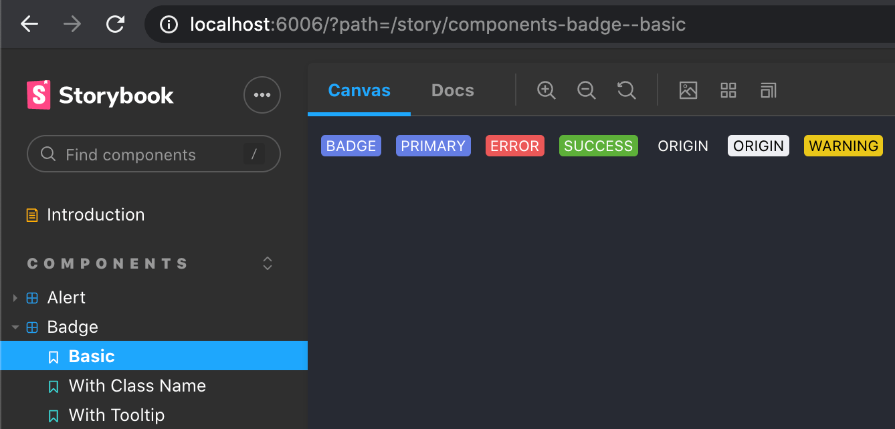
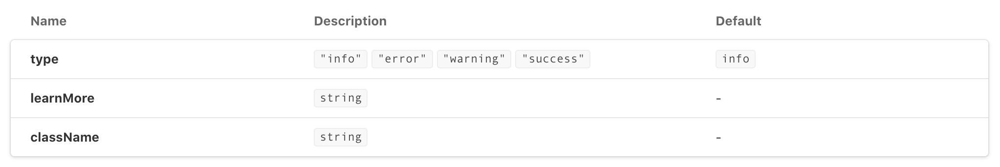
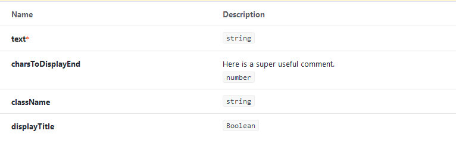
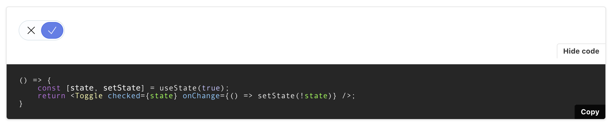

# Proton Design System Storybook

This project is a storybook instance documenting Proton's design system in the scope of Web. It serves as both an isolated development environment for React Components as well as a source of centralized documentation all things design philosophy & technical documentation.

-   [Installation & Running](#installation-&-running)
-   [React component stories](#react-component-stories)
-   [React component props](#react-component-props)
-   [Storybook Canvas block](#storybook-canvas-block)

## Installation & Running

Run docs-only in development mode

```shell
yarn workspace proton-storybook storybook
yarn storybook
```

The start script defaults to running in docs-only mode (`--docs` flag), however another script called "storybook-raw" has been left (original start script) to run storybook in the original configuration. The storybook docs mention storybook being unable to keep a proper cache in docs-only mode, so the raw command can be used if you're experiencing performance issues while developing locally or just if you'd like to run storybook with a canvas view / for viewing canvas specific addons.

```shell
yarn workspace proton-storybook storybook-raw
yarn storybook-raw
```

## React component stories

The main way we intend to convey documentation about React Components in this Storybook is via Storybook's [MDX Docs Suppport](https://storybook.js.org/docs/react/writing-docs/mdx).

For that we employ the pattern of writing a couple of stories in a `Component.stories.tsx` file and linking them to an mdx documentation page through the `<Story />` Storybook Block by referencing the story's id like so:

```jsx
import { Canvas, Story } from '@storybook/addon-docs/blocks';

<Story id="story-id" />;
```

The name you call your mdx file does not matter as it has to be linked manually to the respective component stories file like so (however `Component.mdx` seems like a convenient pattern for mdx pages that are directly linked to a stories file of the same component):

```jsx
import Component from './Component.tsx';
import mdx from './Component.mdx';

export default {
    component: Component,
    title: 'Component',
    parameters: {
        docs: {
            page: mdx,
        },
    },
};
```

The easiest way to find a story-id is by going to a running storybook instance and checking the url when on a story in the canvas:



However the story-id is computed from your story's title and its name, soit is also possible to predict it.

This pattern is documented in the following storybook 'recipe': [CSF Stories with arbitrary MDX](https://github.com/storybookjs/storybook/blob/next/addons/docs/docs/recipes.md#csf-stories-with-arbitrary-mdx)

## React component props

To show the arguments (props) for a certain component in the documentation page use the ArgsTable Storybook Block

```jsx
import { ArgsTable } from '@storybook/addon-docs/blocks';
import { Alert } from 'react-components';

<ArgsTable of={Alert} />;
```



Note: If you comment your props this way in your component in `react-components`:

```
interface Props extends React.HTMLProps<HTMLSpanElement> {
    text: string;
	/**
	 * Here is a super useful comment.
	 */
    charsToDisplayEnd?: number;
```

This comment will be present in StoryBook:



There have been issues with typescript-docgen not being able to correctly extract the args/props for the ArgsTable. The following scenarios cause problems with that.

Importing a component under a different name than it was exportet as

```js
/* foo.js */
export default Foo;

/* bar.js */
import Baz from './foo';
```

Exporting the component as an anonymous value, for example when wrapped in higher order functions and directly exported.

```js
const A = () => {
    /* ... */
};

export default forwardRef(A);
```

One option to deal with this is to wrap the component definition itself so that the wrapped component is named by a variable.

```js
const A = forwardRef(() => {
    /* ... */
});

export default A;
```

## Storybook Canvas block

Usually you'll see a `<Story />` wrapped inside the `<Canvas />` Storybook Block. This is done to show the source code alongside the inline story:

```jsx
import { Canvas, Story } from '@storybook/addon-docs/blocks';

<Canvas>
    <Story id="story-id" />
</Canvas>;
```


